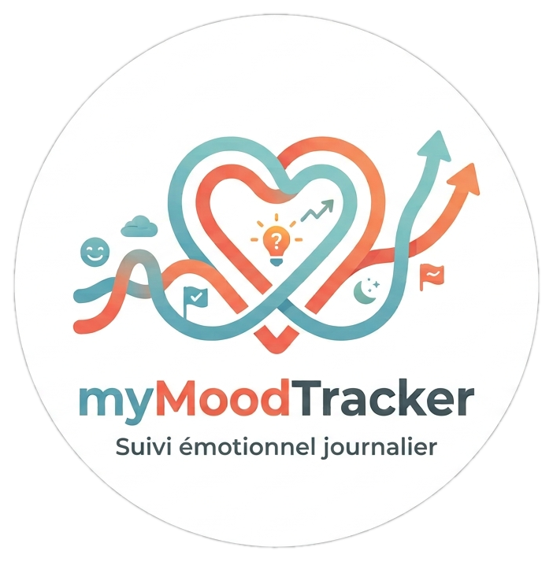

<div align="center">
  

  # myMoodTracker

  **A private, local-network daily mood & wellbeing tracker for two.**

  
  
  
  
  
</div>

---

## 😊 What is it?

myMoodTracker is a lightweight web app, hosted on your own local network, built to track how you're feeling — every day, together. Log your mood through several indicators (physical & mental fatigue, morale, stress, social need, sleep), jot down a dream, and check off your goals for the day as you go. Notable events, positive or negative, enrich the picture — negative ones come with a detailed CBT-inspired analysis grid to help understand what triggers certain emotions. Every entry can stay private or be shared with the other profile, and a shared task list keeps you organized without the mental overhead. It all runs entirely on a Raspberry Pi on your own network — no external service, no cloud — with PDF export available for psychological follow-up if needed.

## ✨ Features

| | |
|---|---|
| 😊 **Daily mood** | 🔋 Physical fatigue · 🧠 Mental fatigue · 🙂 Morale · 🤝 Social need · 😖 Stress · 😴 Sleep quality |
| 🌙 **Dream journal** | Free text + tag (😌 pleasant / 😐 neutral / 😱 nightmare) |
| ✅ **Daily goals** | Checklist, completion rate over time |
| ✨⚡ **Notable events** | Quick note for positive events, full CBT-style analysis grid for negative ones (trigger → consequences) |
| 🛡️🎯🗣️🚧🎨 **Core needs tagging** | Tag any mood/event with one or more fundamental needs (Security, Competence, Self-expression, Limits, Spontaneity) |
| 🔒🌐 **Per-entry visibility** | Every personal entry is private by default, shareable on demand |
| 📋 **Shared task list** | Common to-dos, assignable to either profile |
| 📅 **History** | Review any past day, mine + partner's public entries |
| 📄 **PDF export** | Export negative events for a chosen period — handy for a therapist or personal follow-up |
| 🇫🇷 🇬🇧 **Bilingual UI** | French / English, per profile |

## 🛠️ Tech stack

- **Backend:** FastAPI (Python)
- **Frontend:** HTMX + Jinja2 + plain CSS — no JS build step
- **Database:** SQLite (single file, trivial backup)
- **PDF export:** WeasyPrint
- **Hosting:** Raspberry Pi 4, always-on, on the home LAN

See [`myMoodTracker-specs.md`](./myMoodTracker-specs.md) for the full functional & technical specification, and [`CLAUDE.md`](./CLAUDE.md) for coding conventions.

## 🚀 Getting started

```bash
pip install -r requirements.txt
uvicorn app.main:app --reload --host 0.0.0.0 --port 8000
```

Then open `http://<your-local-ip>:8000` from any device on your network.

## 🔒 Privacy by design

No password-protected cloud account, no external server — your data never leaves your home network. Each profile's private entries stay private, even from the other user; only what's explicitly marked public is shared.

## 📦 Deployment

Runs continuously on a Raspberry Pi 4 (4 GB RAM) via `uvicorn`, ideally wrapped in a `systemd` service for auto-restart. See §7 of the specs for hosting details and backup recommendations.

## 📄 License

Personal project — license to be defined.
